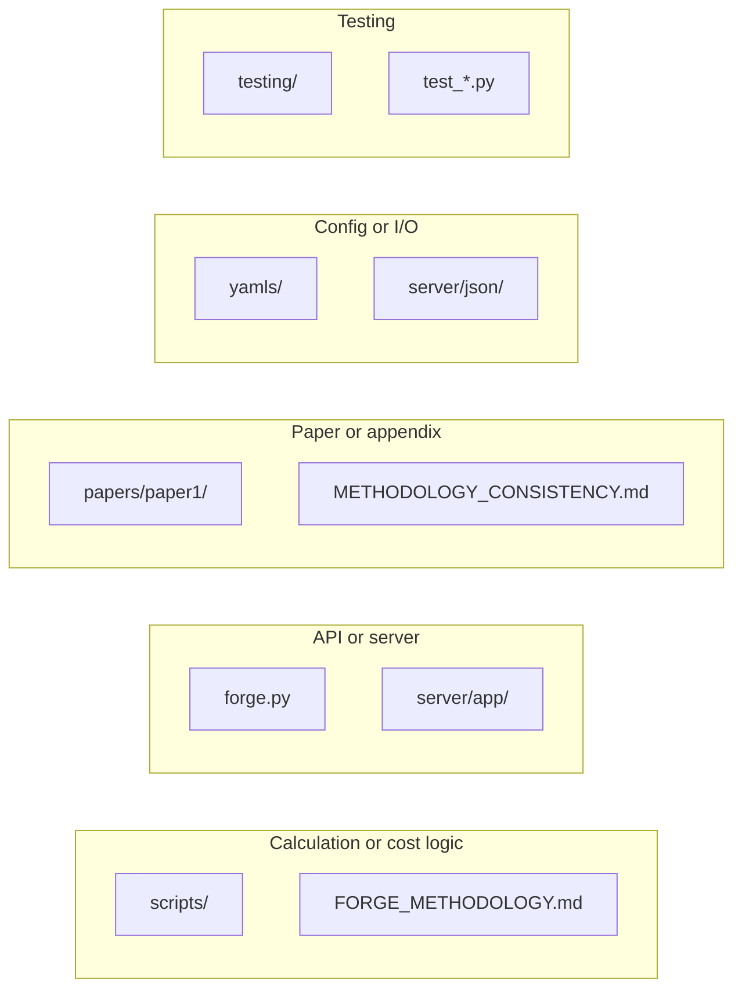

# FORGE Developer Documentation

Comprehensive technical documentation for developers working on FORGE.

**Last Updated:** 2026-05-10
**Version:** 4.0
**Status:** Production-ready

---

## Table of Contents

1. [Project Overview](#project-overview)
2. [Context and information gathering](#context-and-information-gathering)
3. [Quick Start for Developers](#quick-start-for-developers)
4. [Architecture](#architecture)
5. [Development Workflows](#development-workflows)
6. [API Reference](#api-reference)
7. [File Structure](#file-structure)
8. [Testing](#testing)
9. [Known Issues](#known-issues)
10. [Future Improvements](#future-improvements)
11. [Deployment](#deployment)
12. [Troubleshooting](#troubleshooting)

---

## Project Overview

### What is FORGE?

FORGE (Framework for Open Reproducible Grid Economics) is a cost-benefit analysis tool for high-voltage transmission line projects. It calculates 12 cost and benefit categories to help utilities and regulators make informed decisions about energy infrastructure investments.

### Key Features

- **Single I/O contract:** Calculator is YAML in, JSON out (input: `yamls/` or `FORGE_YAMLS_DIR`; output: `forge_results_{scenario_id}.json`). The API still accepts and returns JSON; the server converts client JSON to a temp YAML directory before invoking the calculator.
- **14 calculation scripts:** Build, ROW, environmental, revenue, O&M, risk, benefits, etc.
- **3 Financial Perspectives:** Nominal, AFUDC (regulatory), Present Value (societal)
- **Web UI:** Browser-based interface for editing and running calculations
- **Scenario Manager (comparison table):** In `server/static/index.html`, selected comparison columns are ordered by the flattened **`COMPARISON_METRICS`** catalog. Implementation: **`COMPARISON_METRIC_KEY_ORDER`** and **`sortComparisonColumnsByCatalog()`**. **Add column** uses a fixed-position hierarchical popover (`openComparisonMetricPicker`, super-groups via **`COMPARISON_GROUP_SUPERGROUP`** / **`COMPARISON_SUPERGROUP_ORDER`**), not a flat `<select>`. Add new metrics in the appropriate group/position in `COMPARISON_METRICS` to control sort position; keys not in the catalog sort last. Metrics with **`format: 'text'`** or **`'boolean'`** show **absolutes only** in comparison (no Δ / % Δ); see **`metricSupportsComparisonDelta`** with **`formatDeltaLine`** / **`formatPercentDeltaLine`**.
- **Fuel mix presets:** **`server/json/fuel_mix_presets.json`** + **`app/fuel_mix_presets.py`** + **`GET /api/fuel_mix_presets`**. UI: **Fuel Mixes** dropdown on **Emissions** (above Energy Source Mix table); JSON input mode only. Extend by editing the JSON catalog.
- **REST API:** Programmatic access for integration
- **CLI:** Command-line tool for batch processing

### Cost categories (methodology)

Costs are grouped into **5 categories** (variables, equations, and notation are in **[documentation/FORGE_METHODOLOGY.md](documentation/FORGE_METHODOLOGY.md)**; that document is the full FORGE methodology and takes precedence):

1. **Capital costs:** Build (1.a), Capital ROW—acquisition, holding (1.b), Environmental Mitigation (1.c)
2. **Operational costs:** O&M (2.a), Operational Insurance (2.b), Operational ROW—rent (2.c)
3. **Energy/Emissions costs:** Thermal line loss (3.a), Emissions from line losses (3.b), Residual exceedance (3.c)
4. **Risk costs:** Expected wildfire cost (4.a), Expected outage cost (4.b)
5. **Delay costs:** Base delay (5.a), Congestion delay (5.b), Curtailment delay (5.c)

### Technology Stack

- **Language:** Python 3.8+
- **Web Framework:** FastAPI + Uvicorn
- **Data Processing:** Pandas, NumPy
- **Configuration:** YAML (PyYAML), JSON. The calculator reads only YAML (from a directory); JSON is used at the API boundary and in server templates.
- **Frontend:** Vanilla JavaScript (no frameworks). Config-driven layout via TAB_HIERARCHY (configs.js) + hierarchy engine (hierarchy-engine.js)

**Context optimization:** Use the "Context and information gathering" section below for where to look and how to search. Prefer `documentation/FORGE_METHODOLOGY.md` for methodology and notation. Scope searches to the relevant directory. Prefer search + targeted read for files over ~500 lines.

---

## Context and information gathering

Use this section to reduce context burn and improve answers: start in the right place, prefer search and docs over broad file reads, and treat key docs as canonical.

### Entry points and map

- **Calculation logic:** `scripts/` + `documentation/FORGE_METHODOLOGY.md`
- **API / server:** `forge.py` + `server/app/`
- **Paper and appendix:** Maintained externally (not in this repo).
- **Config:** `yamls/` (or directory set by `FORGE_YAMLS_DIR`); loader mappings in `scripts/yaml_loaders.py`. Server template/merge uses `server/json/`; the merged request is written as a temp YAML directory for the calculator. `json_loaders.py` exists for server-side use; the calculator does not use it.
- **Testing:** `testing/` and root-level `test_*.py`

See [File Structure](#file-structure) for the full tree.

### Search and read strategy

- Prefer **grep** for exact names/symbols; prefer **semantic search** with a target directory.
- Avoid loading full large files when a targeted read or search result suffices.
- Scope searches to the relevant subtree (scripts, documentation, server).

### Canonical references

- **Methodology (variables, equations, notation):** `documentation/FORGE_METHODOLOGY.md`
- **Paper, appendix, and module LaTeX:** Maintained externally (not in this repo).
- **Developer reference:** this file (CLAUDE.md)

### Large files

- **documentation/FORGE_METHODOLOGY.md** (~1850 lines): search for variable/section names, then read the specific section (offset/limit).
- Long scripts (e.g. `forge.py`, `json_output_manager.py`, `yaml_loaders.py`): grep for the function or symbol first, then targeted read.

### Script–cost mapping

| Cost / module | Script |
|---------------|--------|
| Weighted miles | `weighted_miles.py` |
| Build | `build_costs.py` |
| ROW | `row_costs.py` |
| Environmental | `environmental_mitigation.py` |
| Insurance | `insurance_costs.py` |
| Delay | `delay_costs.py` |
| Wildfire | `wildfire_costs.py` |
| Outage | `outage_costs.py` |
| Benefits (congestion/curtailment) | `congestion_curtailment_reduction.py` |
| Energy losses (preprocessing) | `energy_losses.py` |
| Emissions | `emissions.py` |
| Line loss cost | `line_loss_costs.py` |
| O&M | `oandm.py` |
| Revenue | `revenue.py` |
| BCR | `bcr_calculator.py` |

### Where to look by question type



---

## Quick Start for Developers

### Initial Setup

```bash
# Clone and navigate to project
cd FORGE

# Create CLI virtual environment
python3 -m venv venv
source venv/bin/activate
pip install pyyaml pandas numpy

# Create server virtual environment
cd server
python3 -m venv .venv
source .venv/bin/activate
pip install -r requirements.txt
```

### Run Calculations (CLI)

```bash
# Default: read yamls/, write outputs/forge_results_{scenario_id}.json
python forge.py

# With overrides
FORGE_YAMLS_DIR=/path/to/yamls FORGE_SCENARIO_ID=my_id python forge.py

# Legacy: run each script as subprocess
python forge.py --subprocess
```

### Start Web Server

```bash
cd server
./run_calc_server.command
# Server runs at http://localhost:8000
```

### Convert YAML to JSON

```bash
cd server
./convert_yamls.command
# Select source directory
# Output: server/json/final_combined.json
```

The calculator does not take JSON input; conversion from client JSON to YAML happens only at the API boundary (server writes a temp YAML dir before invoking forge). This tool is for refreshing server templates.

---

## Architecture

### High-Level Design

FORGE uses a single calculator contract and two entry points:

1. Entry point (`forge.py` or `forge_processor.py`) receives the request.
2. **14 calculation scripts** run **in-process by default** (or as subprocesses with `--subprocess`); they use **yaml_loaders only** and **JSON output only**.
3. forge.py aggregates results and writes one JSON file (`forge_results_{scenario_id}.json`).
4. Server path: merges request with template, writes **temp YAML directory**, sets `FORGE_YAMLS_DIR`, invokes forge, reads the JSON result, returns the response.

### Design Principles

1. **Single Responsibility:** Each script calculates one cost category.
2. **Single input path (YAML dir):** Calculator reads only from a YAML directory (`yamls/` or `FORGE_YAMLS_DIR`).
3. **Single output path (JSON):** Calculator writes only one JSON result file.
4. **Delegation:** Server delegates to `forge.py`; it does not duplicate calculation logic.
5. **Environment:** Optional overrides via `FORGE_YAMLS_DIR` and `FORGE_SCENARIO_ID`.

### Entry Points

#### 1. CLI: `forge.py`

**Purpose:** Direct command-line calculations.

**Key Functions:**

- `parse_arguments()` - Parse command-line flags (e.g. `--simple`, `--subprocess`, feature toggles)
- `main()` - Orchestrate entire calculation flow (load BCR config, run 14 scripts, aggregate JSON, write output)

**Usage:**

```bash
python forge.py
# Optional env overrides:
FORGE_YAMLS_DIR=/path/to/yamls FORGE_SCENARIO_ID=my_id python forge.py
# Legacy subprocess mode:
python forge.py --subprocess
```

**Flow:** Parse args; load BCR config from YAML; set or generate `FORGE_SCENARIO_ID`; run 14 scripts in-process (or subprocess); aggregate JSON, compute BCR; write `outputs/forge_results_{scenario_id}.json`.

#### 2. API: `server/app/forge_processor.py`

**Purpose:** Web API backend

**Key Functions:**

- `run_forge_calculation(payload)` - Main calculation function

**How it works:**

1. Receives JSON payload with `combined_data` (and optional `scenario_id`).
2. Merges with template if simplified format; writes merged data to a **temp YAML directory** (one file per key), sets **FORGE_YAMLS_DIR**.
3. Invokes `forge.py` via subprocess (no temp JSON input file).
4. Reads `forge_results_{scenario_id}.json`; removes temp YAML dir.
5. Returns structured JSON response (always JSON; no CSV path).

**Why delegate to forge.py?**

- Single source of truth (fix once, works everywhere)
- Automatic benefit from forge.py improvements
- Reduced code: 453 → 189 lines (58% reduction)

### Data Flow

```
YAML directory (yamls/ or FORGE_YAMLS_DIR)
    ↓
Environment (FORGE_YAMLS_DIR, FORGE_SCENARIO_ID)
    ↓
forge.py
    ↓
14 scripts (in-process by default)
    ↓
smart_loaders → yaml_loaders only
    ↓
Calculation logic
    ↓
smart_output → json_output_manager only
    ↓
Output: forge_results_{scenario_id}.json
```

### Smart Loaders & Output

**Purpose:** Provide a single loader/output API to calculation scripts. The calculator has one input path and one output path.

**smart_loaders.py:** Always uses `yaml_loaders`. Scripts read from `YAMLS_DIR` (from `path_config`; overridable via `FORGE_YAMLS_DIR`). There is no branching on input mode; the calculator does not use `json_loaders`.

**smart_output.py:** Always uses `JSONOutputManager` (or the shared aggregator when in-process). There is no CSV branch; scripts always write to the JSON aggregator.

**Benefits:** Scripts use generic imports (`from smart_loaders import load_...`, `from smart_output import FORGEOutputManager`). Single I/O contract; adding a new source (e.g. a database) would be a single adapter that produces a YAML dir or is used at the server boundary.

### Rate Base and ROW Capital vs. Operational

- **Rate base** = AFUDC capital at COD: build\_cost\_afudc + row\_cost\_afudc + env\_mitigation\_afudc (nominal at COD). **Rate-based revenue** uses Option A: the nominal rate base is deflated to base year; annual revenue is constant real $/year; present value uses real WACC—consistent with real discounting elsewhere in FORGE.
- **ROW capital** (acquisition + holding) is AFUDC-eligible and included in capital costs and rate base. **ROW rent** (annual ROW payment) is operational only (O&M + insurance + row rent); it is not in rate base or capital.
- **Cost timing:** AFUDC-eligible cost timing patterns require `during_delay + during_construction = 1` (enforced in `calculate_afudc_capitalized_cost`).

---

## Development Workflows

### Adding a New Cost Module

#### Step 1: Create Calculation Script

```python
# scripts/new_module.py
from smart_loaders import load_project_technical_details, load_financing_details
from smart_output import FORGEOutputManager

def calculate_new_costs(project_data, financing_data):
    """Calculate costs for new module."""
    # Perform calculations
    results = {
        'total_nominal': 0,
        'total_pv': 0,
        # ... more fields
    }
    return results

def main():
    # Load data
    project_data = load_project_technical_details()
    financing_data = load_financing_details()

    # Calculate
    results = calculate_new_costs(project_data, financing_data)

    # Write output
    output_manager = FORGEOutputManager()
    output_manager.add_new_module_costs(results)
    output_manager.write_batch_summary()

    print("New module calculation complete")

if __name__ == "__main__":
    main()
```

#### Step 2: Add Output Methods

For the calculator path, add the new module to **json_output_manager.py** (the calculator writes JSON only):

```python
def add_new_module_costs(self, results):
    """Add new module results to JSON output."""
    self.costs["new_module"] = results
```

#### Step 3: Update forge.py

```python
scripts = [
    "weighted_miles.py",
    "build_costs.py",
    # ... existing scripts
    "new_module.py",  # Add here
]
```

#### Step 4: Test

```bash
# Test individual script (point at a YAML dir and scenario)
export FORGE_YAMLS_DIR=/path/to/yamls   # e.g. path to yamls/
export FORGE_SCENARIO_ID=test
python3 scripts/new_module.py

# Test via forge.py
python forge.py
# Or with overrides:
FORGE_YAMLS_DIR=/path/to/yamls FORGE_SCENARIO_ID=test python forge.py

# Test via API
curl -X POST http://localhost:8000/api/forge/calculate \
  -H "Content-Type: application/json" \
  -d @test_payload.json
```

### Modifying Existing Calculations

#### Update Calculation Logic

1. Locate script in `scripts/` directory
2. Modify calculation function
3. Test with known inputs
4. Verify outputs match expected

#### Update Tests

1. Add test cases for new logic
2. Run test suite
3. Update documentation

### Adding New Input Format

The calculator has a **single input contract**: it reads only from a YAML directory. To support a new source (e.g. a database or XML):

- **Option A:** Build an **adapter** that produces a YAML directory (e.g. export DB → YAML files), then point `FORGE_YAMLS_DIR` at that directory.
- **Option B:** Use the new source at the **server boundary**: the API can accept the new format, merge it into the request, and write the merged data to the temp YAML directory before invoking forge.

The calculator does not branch on input format; `smart_loaders` always uses `yaml_loaders`.

### Adding New Output Format

The calculator has a **single output**: one JSON file per run (`forge_results_{scenario_id}.json`). To produce another format (e.g. CSV):

- Add a **post-step** that reads `forge_results_*.json` and exports to CSV (or another format). Do not change the calculator's output contract.

---

## API Reference

### FastAPI Endpoints

#### GET `/`

Returns web UI (index.html)

**Response:** HTML page

---

#### GET `/api/final_combined`

Returns combined JSON configuration

**Response:**

```json
{
  "01_project_technical_details": {...},
  "02_project_physical_details": {...},
  ...
}
```

---

#### POST `/api/forge/calculate`

Runs FORGE calculations. The API always returns JSON results; the server writes merged data to a temp YAML directory, sets `FORGE_YAMLS_DIR`, invokes forge, and returns the JSON from `forge_results_{scenario_id}.json`.

**Request:**

```json
{
  "scenario_id": "test",
  "combined_data": {...}
}
```

`input_mode` and `output_mode` may be accepted for backwards compatibility but are ignored; the calculator always uses YAML input and JSON output.

**Response:**

```json
{
  "success": true,
  "scenario_id": "test",
  "timestamp": "2025-11-10T12:00:00",
  "results": {
    "scenario_id": "test",
    "technical_parameters": {...},
    "costs": {
      "build": {...},
      "row": {...},
      ...
    },
    "benefits": {
      "congestion_curtailment": {...}
    },
    "summary": {...},
    "bcr": {...}
  },
  "error": null
}
```

---

#### GET `/api/outputs/{filename}`

Downloads output file (e.g. CSV). Legacy/optional: the calculator writes JSON only; this endpoint is for any server-exposed outputs (e.g. CSV exported from JSON or from batch runs).

**Query Parameters:**

- `download` (bool, optional): Force download vs inline preview

**Example:**

```bash
# Preview
curl http://localhost:8000/api/outputs/batch_summary.csv

# Download
curl http://localhost:8000/api/outputs/batch_summary.csv?download=true \
  -o batch_summary.csv
```

**Security:**

- Only .csv files allowed
- Directory traversal prevented
- File existence validated

---

## File Structure

```
FORGE/
├── forge.py                       # CLI entry point
├── yaml_to_json.py               # YAML→JSON converter (server/template use)
├── cleanup_forge.sh               # Cleanup script
│
├── scripts/                      # Calculation modules (14 scripts)
│   ├── smart_loaders.py          # Always yaml_loaders
│   ├── smart_output.py           # Always JSON output
│   ├── yaml_loaders.py           # YAML input (calculator path)
│   ├── json_loaders.py           # JSON input (server-side only; calculator does not use)
│   ├── csv_output_manager.py    # Optional/legacy (e.g. batch export)
│   ├── json_output_manager.py   # JSON output (calculator path)
│   ├── financial_utils.py       # AFUDC, PV calculations
│   ├── bcr_calculator.py        # Benefit-cost ratio
│   │
│   ├── weighted_miles.py        # 1. Preprocessing
│   ├── build_costs.py           # 2. Build costs
│   ├── insurance_costs.py       # 3. Insurance
│   ├── row_costs.py             # 4. Right-of-way
│   ├── environmental_mitigation.py  # 5. Environmental
│   │                                  # Note: Credits set to zero for reconductoring projects
│   ├── delay_costs.py           # 6. Delays
│   ├── wildfire_costs.py        # 7. Wildfire risk
│   ├── outage_costs.py          # 8. Outage risk
│   ├── congestion_curtailment_reduction.py  # 9. Benefits
│   ├── energy_losses.py         # 10. Preprocessing
│   ├── emissions.py             # 11. Emissions
│   ├── line_loss_costs.py       # 12. Line losses
│   ├── oandm.py                 # 13. O&M
│   ├── revenue.py               # 14. Revenue
│   └── ...                      # (bcr_calculator invoked from forge.py)
│
├── yamls/                        # YAML configuration (22 files)
│   ├── 01_project_technical_details.yaml
│   ├── 02_project_physical_details.yaml
│   └── ...
│
├── outputs/                      # Calculation results
│   ├── forge_results_*.json      # Primary output (one per scenario)
│   └── json_output_*.json       # Optional temp files when using --subprocess
│
├── server/                       # FastAPI web server
│   ├── app/
│   │   ├── main.py               # FastAPI app
│   │   ├── forge_processor.py     # Calculation orchestrator
│   │   └── processor.py          # Demo processor
│   │
│   ├── static/
│   │   ├── index.html            # Web UI (SPA)
│   │   ├── styles.css            # All CSS (extracted)
│   │   ├── configs.js            # Config objects (TAB_HIERARCHY, FIELD_METADATA, etc.)
│   │   └── hierarchy-engine.js   # TAB_HIERARCHY engine (applyTabHierarchy, humanizeKey)
│   │
│   ├── json/                     # JSON configs (21 files)
│   │   ├── 01_project_technical_details.json
│   │   └── final_combined.json   # Combined config
│   │
│   ├── logs/                     # Server logs
│   ├── yaml_to_json.py           # Server YAML converter
│   ├── requirements.txt          # Python dependencies
│   │
│   ├── run_calc_server.command   # Start FastAPI
│   ├── web_ui_server.command     # Start static server
│   └── convert_yamls.command     # YAML→JSON tool
│
├── venv/                         # CLI virtual env
│
├── README.md                     # User documentation
├── Claude.md                     # This file
└── MODE_FLOW_DIAGRAM.md          # Architecture docs
```

---

## Testing

### Manual Testing

#### Test CLI

```bash
# Default: YAML dir → JSON output
python forge.py

# With overrides
FORGE_SCENARIO_ID=test python forge.py
# Or:
FORGE_YAMLS_DIR=/path/to/yamls FORGE_SCENARIO_ID=test python forge.py
```

#### Test API

```bash
# Start server
cd server
./run_calc_server.command

# Test in browser
open http://localhost:8000

# Test with curl
curl -X POST http://localhost:8000/api/forge/calculate \
  -H "Content-Type: application/json" \
  -d @test_payload.json
```

#### Test Individual Script

```bash
export FORGE_YAMLS_DIR=/path/to/yamls   # e.g. path to yamls/
export FORGE_SCENARIO_ID=test
python3 scripts/build_costs.py
```

### Test Scripts

```bash
# API vs CLI comparison
python test_api_vs_cli.py

# FORGE processor test
python test_forge_processor.py
```

### Unit Testing

_To be implemented_

Planned structure:

```
tests/
├── test_loaders.py
├── test_output_managers.py
├── test_calculations.py
├── test_api.py
└── fixtures/
    ├── sample_yaml/
    └── sample_json/
```

---

## Known Issues

### Issue 1: Missing YAML File Mappings (FIXED)

**Status:** ✅ Resolved in v2.0

**Problem:** `yaml_loaders.py` was missing 5 file mappings, causing YAML mode to fail.

**Solution:** Added all missing entries to `yaml_file_map` dictionary.

### Issue 2: Server Processor Code Duplication (FIXED)

**Status:** ✅ Resolved in v2.0

**Problem:** `forge_processor.py` duplicated all calculation logic (453 lines).

**Solution:** Refactored to delegate to `forge.py` via subprocess (189 lines, 58% reduction).

### Issue 3: JSON Data Loading in Parent Process (OBSOLETE)

**Status:** Obsolete in v3.0

The calculator no longer has a JSON input mode. All input is via a YAML directory; the server converts client JSON to a temp YAML dir at the API boundary. This issue no longer applies.

### Issue 4: Module-Specific CSV Files Not Generated

**Status:** ⚠️ Known limitation

**Problem:** The calculator output is **JSON only** (`forge_results_*.json`). There is no CSV output from the calculator.

**Workaround:** For CSV or per-module files, add a separate export step that reads `forge_results_*.json` and writes the desired CSV(s). Do not expect the calculator to produce CSV directly.

### Issue 5: Reconductoring Environmental Mitigation Credits (RESOLVED)

**Status:** ✅ Resolved

**Problem:** Reconductoring projects were being charged full environmental mitigation credits (wetland and habitat credits), which is inappropriate since they use existing ROW and don't create new permanent environmental impacts.

**Solution:** Modified `environmental_mitigation.py` to set credits to zero for reconductoring projects. Base environmental mitigation costs still apply for temporary construction impacts (access roads, staging areas, erosion control).

**Implementation:** Added `reconductoring` parameter to `calculate_environmental_mitigation_costs()` function. When `reconductoring=True`, wetland and habitat credits are set to zero.

**Impact:** This makes reconductoring economics more realistic. For example, S4's environmental mitigation costs reduced from $60.3M to ~$5.7M (90% reduction), making capital costs more accurate.

### Issue 6: Emissions from Line Losses Use Average Fuel Mix

**Status:** ⚠️ Known limitation / Future improvement

**Problem:** Emissions due to line-loss compensation are calculated using the configured **average** energy source mix (canonical YAML **`yamls/18_energy_source_mix.yaml`**, merged at load with `16_emissions_reductions` in `load_emissions_details()`). For incremental emissions from extra MWh of loss, the theoretically correct measure is the **marginal** unit (or marginal emission factor), not the system average.

**Current behavior:** The emissions script (`scripts/emissions.py`) uses `energy_source_mix` shares as weights: emissions = TEC × Σ (mix_share_j × intensity_j). Average mix data is easy to obtain and consistent with FORGE’s current annual-level resolution.

**Decided future direction:** The long-term plan is to base line-loss emissions on **EPA eGRID** (Emissions & Generation Resource Integrated Database): use eGRID **total output emission rates** for average-grid (scope 2–style) estimates and eGRID **non-baseload output emission rates** as a marginal-ish proxy when appropriate. eGRID rates are operational/stack (direct) emissions per MWh, not lifecycle—so adopting eGRID is a conceptual shift from current lifecycle-ish intensity defaults. See [papers/paper1/future_improvements.md](papers/paper1/future_improvements.md) for eGRID details, rationale for deferral, and when to revisit.

---

## Future Improvements

Planned or desired improvements that are intentionally deferred are documented in **[papers/paper1/future_improvements.md](papers/paper1/future_improvements.md)**. That document explains current behavior, the proposed improvement, and why it is saved for later (e.g. dependency on hourly resolution, data availability).

---

## Deployment

### Production Checklist

- [ ] Set strong SECRET_KEY in FastAPI
- [ ] Configure CORS for production domains
- [ ] Set up reverse proxy (nginx)
- [ ] Enable HTTPS
- [ ] Configure logging
- [ ] Set up monitoring
- [ ] Configure file permissions
- [ ] Set resource limits (timeout, memory)
- [ ] Test CLI (YAML dir → JSON) and API (JSON request → JSON response)
- [ ] Verify JSON results returned
- [ ] Test with realistic data sizes

### Environment Setup

```bash
# Production environment variables
export FORGE_ENV=production
export FORGE_LOG_LEVEL=INFO
export FORGE_MAX_TIMEOUT=600000
export FORGE_TEMP_DIR=/var/tmp/forge
```

### Docker Deployment

_To be implemented_

Planned Dockerfile:

```dockerfile
FROM python:3.11-slim

WORKDIR /app
COPY . /app

RUN pip install -r server/requirements.txt
RUN pip install -r requirements.txt

EXPOSE 8000

CMD ["uvicorn", "server.app.main:app", "--host", "0.0.0.0", "--port", "8000"]
```

---

## Troubleshooting

### Server Won't Start

**Error:** `Port 8000 already in use`

**Solution:**

```bash
# Find process
lsof -i :8000

# Kill process
kill -9 <PID>

# Or use different port
PORT=8001 ./run_calc_server.command
```

### Calculation Fails with KeyError

**Error:** `KeyError: 'some_field'`

**Cause:** Missing or incorrect configuration data

**Solution:**

```bash
# Verify JSON structure
python3 -c "import json; print(json.load(open('server/json/final_combined.json')))"

# Regenerate from YAML
cd server
./convert_yamls.command
```

### Environment Variables Not Set

**Error:** Scripts can't find YAML dir or scenario ID

**Solution:**

```bash
# Check environment
env | grep FORGE

# Required for overrides (defaults: yamls/ and generated scenario ID)
# FORGE_YAMLS_DIR  - path to YAML config directory
# FORGE_SCENARIO_ID - scenario identifier for output filename
# Clear if needed
unset FORGE_YAMLS_DIR
unset FORGE_SCENARIO_ID
```

### Temp Files Not Cleaned Up

**Symptom:** `json_output_*.json` files remain in `outputs/`

**Solution:**

```bash
# Manual cleanup
rm outputs/json_output_*.json

# Or use cleanup script
./cleanup_forge.sh
```

### Virtual Environment Issues

**Error:** Module not found

**Solution:**

```bash
# CLI venv
cd FORGE
rm -rf venv
python3 -m venv venv
source venv/bin/activate
pip install pyyaml pandas numpy

# Server venv
cd server
rm -rf .venv
python3 -m venv .venv
source .venv/bin/activate
pip install -r requirements.txt
```

---

## Contributing

### Code Style

- Follow PEP 8 style guide
- Use type hints where appropriate
- Add docstrings to all functions
- Comment complex logic
- Keep functions focused and small

### Git Workflow

1. Create feature branch: `git checkout -b feature/new-module`
2. Make changes and test thoroughly
3. Commit with descriptive messages
4. Push and create pull request
5. Request code review

### Documentation

- Update README.md for user-facing changes
- Update Claude.md for developer changes
- Update MODE_FLOW_DIAGRAM.md for architecture changes
- Add inline comments for complex logic

---

## Version History

### v4.0 (2026-05-10)

**Major changes:**

- **Wildfire liability removal:** Cost category 4.a (wildfire liability insurance) deleted. Risk costs now have 2 components: expected wildfire cost (4.a) and expected outage cost (4.b). Total cost/benefit categories reduced from 13 to 12.
- **Primary BCR removal:** `BCRConfig` dataclass deleted; `bcr_primary` metric removed from calculator, web UI, CSV export, and scenario files.
- **4-file frontend:** CSS extracted to `styles.css` (~1846 lines); config objects extracted to `configs.js` (~909 lines); TAB_HIERARCHY engine extracted to `hierarchy-engine.js` (~294 lines). `index.html` reduced to ~6850 lines.
- **TAB_HIERARCHY migration:** All 9 input tabs (Project, Route & Terrain, Financial, Capital Costs, Operational Costs, Delay Costs, Risk Costs, Emissions, Benefits) use config-driven declarative layout via `TAB_HIERARCHY` in `configs.js`.
- **Benefit/cost category restructuring:** Benefits split into remedial ($B_{\text{remedial}}$: congestion + curtailment) and enabling ($B_{\text{enabling}}$: delivered energy). Costs organized into four reporting categories: hard, soft, risk, emissions.
- **Scenario Manager features:** Baseline deltas, hierarchical metric picker with super-groups, select-all, fuel mix presets dropdown.

### v3.0 (2026-03-11)

**Single calculator contract (YAML in, JSON out):**

- Calculator reads only from a YAML directory (`yamls/` or `FORGE_YAMLS_DIR`); writes only JSON (`forge_results_{scenario_id}.json`).
- Server writes merged request to a temp YAML directory and sets `FORGE_YAMLS_DIR`; no temp JSON input file.
- Calculator always uses `yaml_loaders` and `JSONOutputManager`; no `-j`/`-o`/`--id` flags; scenario via `FORGE_SCENARIO_ID`.
- Scripts run in-process by default; `--subprocess` remains for legacy.
- See [audit/refactor51126.md](../audit/refactor51126.md) and [MODE_FLOW_DIAGRAM.md](MODE_FLOW_DIAGRAM.md).

### v2.0 (2025-11-10)

**Major Changes:**

- Added JSON input/output modes
- Implemented command-line flags (`-j`, `-o`, `--id`)
- Refactored server processor to delegate to `forge.py`
- Fixed YAML loader missing file mappings
- Created comprehensive documentation

**Improvements:**

- Reduced server processor code by 58% (453 → 189 lines)
- Single source of truth for calculations
- Web UI with CSV preview and download
- Automatic temp file cleanup
- Better error handling

### v1.0 (2025-10-31)

**Initial Release:**

- 13 calculation modules
- YAML input, CSV output
- CLI interface (`forge.py`)
- BCR calculator
- Financial utilities (AFUDC, PV)

---

## License

University of Texas at Austin

---

## Support and Related

For questions or issues:

- Check README.md for user documentation
- Check [MODE_FLOW_DIAGRAM.md](MODE_FLOW_DIAGRAM.md) for architecture
- Review [codebase.md](../codebase.md) for file/flow reference
- Review [audit/refactor51126.md](../audit/refactor51126.md) for v3.0 refactor details
- Review code comments in calculation scripts
- Test with known-good YAML files

---

**End of Developer Documentation**
